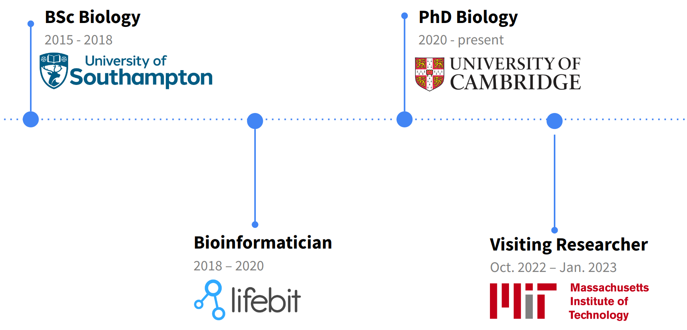

```{r setup, include=FALSE}
knitr::opts_chunk$set(echo = FALSE)
library(dplyr)
library(ggplot2)
library(knitr)
library(rmarkdown)
```

<!--
```{bash, include=FALSE, echo=FALSE}
# Activate the conda environment
source ~/anaconda3/etc/profile.d/conda.sh
conda activate commec-dev
```
-->

\hfill \break
\hfill \break
Code for this handout is available at: https://github.com/PhilPalmer/about-common-mechanism
\clearpage
\newpage

# Introduction

## About me

I'm a final year biology PhD student at the University of Cambridge, working on computational methods to design broad-spectrum vaccines and antibodies.
As shown in the image below, I completed my undergraduate degree in biology at the University of Southampton,
worked for two years in bioinformatics at a biotech start-up in London,
and have interned at the Massachusetts Institute of Technology (MIT) working in metagenomics.

```{r, echo=FALSE, out.width="65%"}

```

# Background

## DNA synthesis

Biotechnology is rapidly becoming more capable, accessible and affordable [@gerstein_emerging_2024].
For example, as shown in the figure below, the cost of DNA sequencing and gene synthesis has decreased by several orders of magnitude over the past two decades [@carlson_dna_2022].


```{r, echo=FALSE, eval=FALSE, out.width="60%", fig.cap="Price Per Base of DNA Sequencing and Synthesis (Data from Carlson 2022)"}
library(ggplot2)
library(RColorBrewer)
library(tidyr)

data <- read.csv("data/dna_synthesis_cost.csv")

# Reshape the data for plotting
data_long <- pivot_longer(data, cols = -Year, names_to = "Type", values_to = "Price")

# Fix legend names by replacing periods with spaces
data_long$Type <- gsub("\\.", " ", data_long$Type)
data_long$Type <- gsub(" Column", "(Column)", data_long$Type)

# Remove NA values
data_long <- data_long %>% filter(!is.na(Price))

# Create the plot
ggplot(data_long, aes(x = Year, y = Price, color = Type, shape = Type)) +
  geom_line(na.rm = TRUE) +
  geom_point() +
  scale_y_log10(breaks = scales::trans_breaks("log10", function(x) 10^x),
                labels = scales::trans_format("log10", scales::math_format(10^.x))) +
  scale_x_continuous(breaks = seq(1990, 2020, 2)) +
  labs(title = "",
       x = "",
       y = "US Dollars") +
  scale_color_brewer(palette = "Set1") +
  theme_minimal() +
  theme(legend.position = "bottom", 
        legend.title = element_blank(),
        panel.grid.major.y = element_line(color = "grey80"),
        panel.grid.minor.y = element_line(color = "grey90"),
        panel.grid.major.x = element_blank())

# Save the plot
ggsave("images/price_dna_sequencing_synthesis.png", dpi = 300)
```

\begin{minipage}{0.65\textwidth}
\centering
\includegraphics[width=\linewidth]{images/price_dna_sequencing_synthesis.png}
\captionof{figure}{Price Per Base of DNA Sequencing and Synthesis (Data from Carlson 2022).}
\end{minipage}
\hfill
\begin{minipage}{0.32\textwidth}
This rapid decrease in the cost of DNA synthesis is due to the modern chemical synthesis of DNA which uses phosphoramidite chemistry.
This method was original developed in the 1980s and has been refined since then to rapidly and accurately synthesise DNA.
The process involves protecting the reactive 5'-hydroxyl group of each nucleotide with a dimethoxytrityl (DMT) group.
During synthesis, this DMT group is selectively removed, allowing for the controlled, sequential addition of nucleotides to build the desired DNA sequence (Frank 2024).
\end{minipage}

## Misuse risk

The rapid decrease in DNA synthesis costs has driven progress in biotechnology, helping to address global challenges in health, climate change and food security [@wheeler_developing_2024]. However, DNA synthesis, combined with other dual-use technologies, poses misuse risks by malicious actors:

1. **Reverse genetics protocols:** The 2018 synthesis of horsepox virus raised concerns about potential smallpox virus synthesis [@noyce_construction_2018]. Reverse genetics protocols are now available to recreate many pathogens from their DNA sequence, as shown by SARS-CoV-2 synthesis [@thi_nhu_thao_rapid_2020].

2. **Gain-of-function research of concern (GOFRC):** GOFRC studies have identified pathogens with pandemic potential, such as H5N1 influenza, that could be synthesised and released by malicious actors [@herfst_airborne_2012].

3. **AI-enabled biological design tools:** Advances in deep learning for protein design could enhance pathogens' pandemic potential, e.g., by conferring immune evasion capabilities [@thadani_learning_2023].

While rare, there is some historical precedent for bioterrorism. Perhaps the two most notable incidents are the Aum Shinrikyo cult's attempts to synthesise and release anthrax and botulinum toxin in 1990s Japan, and the 2001 US anthrax attacks [@sugishima_aum_2003]. However, these incidents used outdated biotechnologies, and the bioterrorism risk has since evolved.

## DNA synthesis screening

Screening DNA synthesis orders to prevent harmful or dangerous sequence synthesis is key to mitigating misuse risks.
As of 2022, at least 57 DNA synthesis companies existed globally, with nearly half being International Gene Synthesis Consortium (IGSC) members, performing voluntary DNA sequence screening, as shown in Figure \ref{fig:dna_synthesis_companies} [@delaney_airtable_2022].^[A common statistic suggests 80% of DNA synthesis orders are screened. While hard evidence for this figure is lacking, it seems reasonable given that the IGSC represents the 10 largest DNA synthesis companies [@williams_preventing_2023].]
Additionally, there are several software methods available to DNA synthesis providers to screen DNA sequences for pathogens and toxins, as shown in Table \ref{tab:screening_methods} [@frank_evaluation_2024].

<!--
```{r, echo=FALSE, out.width="70%", fig.cap="Number of DNA Synthesis Companies per Country (Data from Delaney 2022)"}
library(ggplot2)
library(dplyr)
library(RColorBrewer)

# Read the CSV file
dna_synthesis_companies_csv <- "data/dna_synthesis_companies.csv"
dna_companies <- read.csv(dna_synthesis_companies_csv)

# Get the % of companies that are members of the IGSC (where "screening" == "IGSC")
# igsc_membership <- dna_synthesis_companies %>%
#     count(Screening) %>%
#     mutate(percentage = n / sum(n) * 100)
# igsc_membership

# Convert the Screening column to a binary variable indicating whether they screen or not
dna_companies <- dna_companies %>%
  mutate(Screening = ifelse(Screening == "No", "No", "Yes"))

# Summarize the number of companies per country and screening status
country_summary <- dna_companies %>%
  group_by(Country, Screening) %>%
  summarise(CompanyCount = n(), .groups = 'drop') %>%
  arrange(desc(CompanyCount))

# Plot the number of companies per country with screening status
ggplot(country_summary, aes(x = reorder(Country, -CompanyCount), y = CompanyCount, fill = Screening)) +
  geom_bar(stat = 'identity') +
  coord_flip() +
  labs(title = '',
       x = 'Country',
       y = 'Number of Companies',
       fill = 'Perform Screening') +
  scale_fill_brewer(palette = "Set1") +
  theme_minimal() +
  theme(legend.position = "bottom")

# Save the plot
ggsave("images/dna_synthesis_companies.png")
```
-->

\begin{minipage}{0.47\textwidth}
\centering
\includegraphics[width=\linewidth]{images/dna_synthesis_companies.png}
\captionof{figure}{Number of DNA Synthesis Companies per Country (Data from Delaney 2022).}
\label{fig:dna_synthesis_companies}
\end{minipage}
\hfill
\begin{minipage}{0.5\textwidth}
\centering
\captionof{table}{Software methods available for DNA sequence screening.}
\label{tab:screening_methods}
\begin{tabular}{p{0.3\linewidth} p{0.65\linewidth}}
\toprule
\textbf{Method} & \textbf{Description} \\
\midrule
PathoFact & Identifies virulence factors and antibiotic resistance in metagenomic datasets. \\
DeePac and PaPrBaG & Uses ML to predict pathogenicity from bacterial genomes. \\
SeqScreen & Screens DNA sequence orders for pathogen sequences using ML. \\
SecureDNA & Screens orders against a secure database while protecting client query privacy. \\
ThreatSeq & Uses a curated blacklist and predictive model to screen for biothreats. \\
FastNA & Detects harmful sequences with diagnostic signature generation. \\
BLiSS & Aligns sequences to databases to identify sequences of concern. \\
\bottomrule
\end{tabular}
\end{minipage}


# The International Common Mechanism for DNA Synthesis Screening

## Overview

As shown in Figure \ref{fig:common_mechanism_overview}, the International Common Mechanism will provide resources for each step of synthesis screening, including software for sequence screening and resources to facilitate customer screening.

\begin{figure}[ht]
\centering
\includegraphics[width=0.85\linewidth]{images/common_mechanism_overview.png}
\captionof{figure}{Steps in the DNA synthesis screening process (from IBBIS 2024).}
\label{fig:common_mechanism_overview}
\end{figure}

## Sequence screening

The Common Mechanism's software for sequence screening was recently made available on GitHub for beta testing.
The software aims to establish a baseline for DNA synthesis screening, addressing three key challenges:

1. Reducing costs and meeting commercial needs for synthesis providers
    - Cheaper screening processes are necessary as synthesis costs decrease and order volumes increase, creating an economic burden for providers.
    - Providers prefer in-house screening to protect sensitive customer data and maintain trust.
2. Building international trust in screening practices
    - There is limited international collaboration on screening standards, with few shared practices.
    - U.S. resources for screening are tied to national defense and not widely accessible or trusted globally.
3. Integrating screening capabilities into benchtop devices
    - As benchtop synthesis devices become more common, integrating effective and efficient screening into these devices is necessary.
    - Many manufacturers plan to use a "phone home" approach for cloud-based screening, raising similar challenges to traditional providers.

The Common Mechanism screens sequences $\geq$ 50 nucleotides and flags sequences of concern using three analysis modules:

\begin{minipage}{0.3\textwidth}
1. \textbf{Biorisk Database Comparison (M1)}: Uses hidden Markov Models models to detect variants using an initial database from public sources limited to sequences in regulated pathogens and toxins.

2. \textbf{Taxonomic Best Match (M2)}: Compares orders against public DNA/protein sequences and cross-references with international control lists using BLAST and/or DIAMOND.

3. \textbf{Benign Gene Identification (M3)}: Evaluates sequences matching regulated, non-viral organisms and identifies known benign functions.
\end{minipage}
\hfill
\begin{minipage}{0.65\textwidth}
\centering
\includegraphics[width=\linewidth]{images/common_mechanism_seq_screening.jpg}
\captionof{figure}{Common Mechanism A) analysis module and B) decision-making framework (from Wheeler, 2024)}
\label{fig:common_mechanism_seq_screening}
\end{minipage}

Figure \ref{fig:common_mechanism_seq_screening}B shows the decision-making framework for the Common Mechanism, which flags all regulated pathogen and toxins, as well as virulence factors from non-viral regulated pathogens consistent with export controls.

## Testing

To evaluate the Common Mechanism, I installed the software on my laptop and tested it using the SARS-CoV-2 Nucleoprotein sequence, which I had previously ordered from a DNA synthesis company as part of my PhD research.
I ran the software in `--fast` mode, which only requires the smaller biorisk and benign databases, rather than the full NCBI databases that demand 275 - 650 GB of disk space.

The screening process successfully identified sequence similarity to the SARS-realted Nucleoprotein:

```{bash, eval=FALSE, echo=TRUE}
commec screen -d dbs/ -o ./fast-cov example_data/cov.fasta --fast
```

```{bash, eval=TRUE, echo=FALSE}
cat ../common-mechanism/fast-cov.screen
```

This was then flagged as a virulence factor:

```{bash, eval=FALSE, echo=TRUE}
commec flag .
```

```{bash, eval=FALSE, echo=FALSE}
cat ../common-mechanism/flags*.csv
```

| query | biorisk | vf | reg_virus | reg_bacteria | reg_euk | mix_reg_non_reg | benign |
|-------|---------|----|-----------|--------------|---------|-----------------|---------
| SARS-2_N | P | F | - | - | - | - | - |

\newpage

# Improving the Common Mechanism

## Expanding the Common Mechanism

Wheeler et al. 2024 suggested three areas for improving the Common Mechanism:

\begin{table}[ht]
\centering
\begin{tabular}{p{0.25\linewidth} p{0.75\linewidth}}
\toprule
\textbf{Suggestion} & \textbf{Example(s)} \\
\midrule
1. Expand beyond regulated pathogens and toxins & Expand the list of sequences of concern to include those not derived from regulated pathogens and toxins, as stated in the updated HHS Screening Framework. \\
2. Update screening as science and policy develop & IBBIS could host and update sequence databases as new sequences of concern are identified or policies change. Respond to advances in deep learning methods that could evade screening or better identify sequences of concern. \\
3. Limit information hazards from shared sequence databases & Consistent with the HHS Screening Framework, only share databases containing novel sequences of concern with trusted partners. \\
\bottomrule
\end{tabular}
\caption{Suggestions for improving the Common Mechanism (Wheeler et al. 2024).}
\end{table}

## My suggestion for improvement

While the above suggestions are crucial for reducing misuse risks associated with DNA synthesis, I propose an additional, more fundamental, area for improvement.

\begin{minipage}{0.5\textwidth}
To illustrate, consider DNA synthesis screening as fences preventing access to a hazardous area. Different companies own parts of the land surrounding this area, and many, including IGSC members, have erected fences. However, gaps exist where some companies perform no screening. As non-IGSC companies are known, these gaps are visible to potential bad actors.
\end{minipage}
\hfill
\begin{minipage}{0.45\textwidth}
\centering
\includegraphics[width=\linewidth]{images/screening_fence_analogy.png}
\captionof{figure}{DNA synthesis screening analogy (from Esvelt, 2023)}
\end{minipage}

Using this analogy, previous suggestions to expand the Common Mechanism may be likened to building higher fences. However, aligning with the overarching goal of providing a baseline for DNA synthesis screening, I suggest first ensuring all companies have a fence.
In other words, we should **focus on increasing the adoption of the Common Mechanism by DNA synthesis companies that do not currently perform screening**.

Strategies to achieve this could include:

1. **Awareness**: Identify companies not performing screening (there are 31 such companies according to Delaney 2022) and conduct targeted outreach about the Common Mechanism and its benefits.
2. **Documentation**: Refine and improve implementation guides to facilitate easier adoption.
3. **Training**: Provide workshops on implementing the Common Mechanism.
4. **Support**: Offer technical assistance to companies during implementation.
5. **Onboarding**: Streamline the process for new companies to adopt the Common Mechanism.
6. **Incentives**: Provide motivation for adoption through financial incentives, recognition, or regulation.

I am not aware of the existing work in this area but by focusing on widespread adoption, we can establish a more comprehensive baseline for DNA synthesis screening, significantly reducing potential misuse risks while building on the valuable suggestions for expansion proposed by Wheeler et al.

# References
